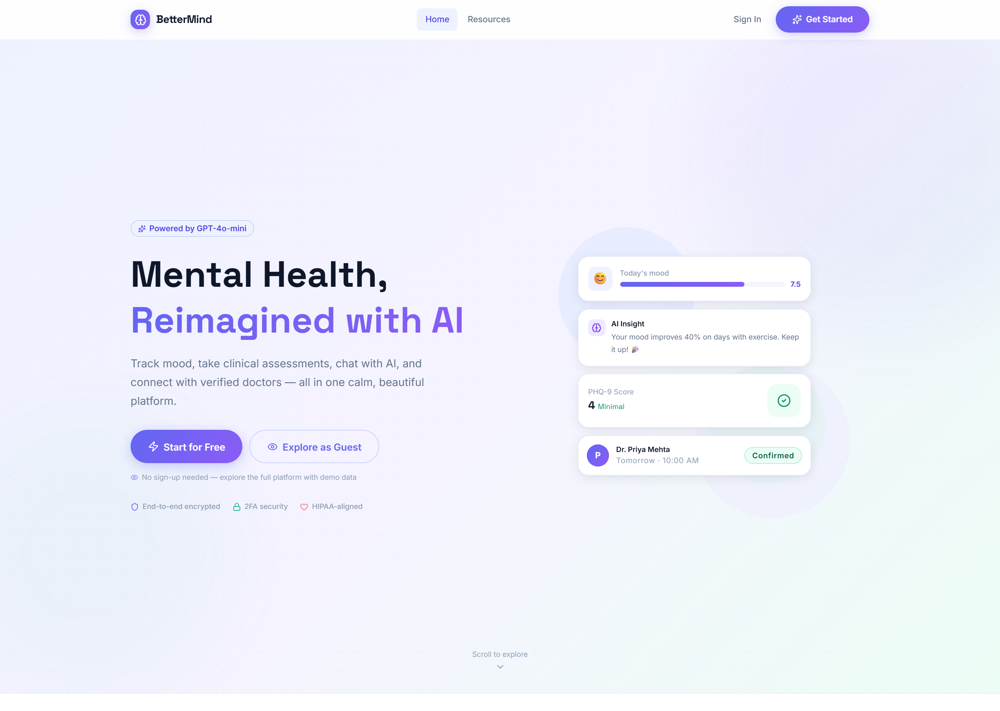
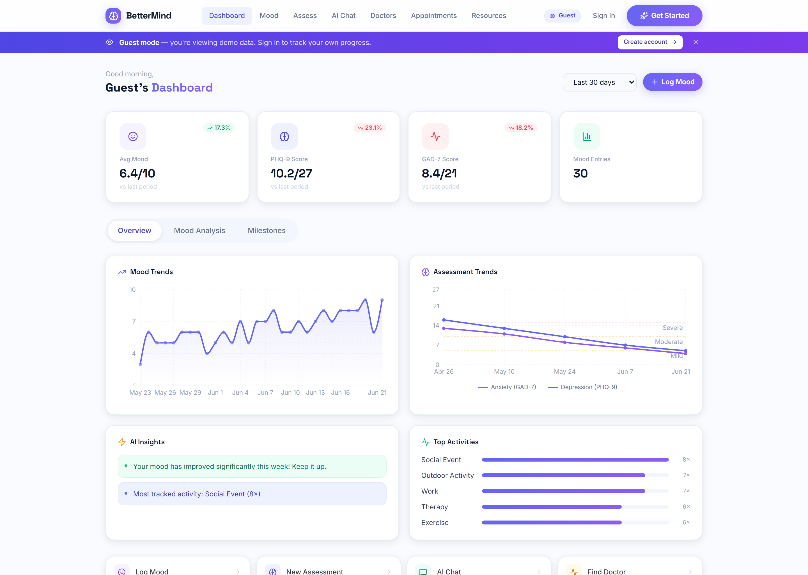
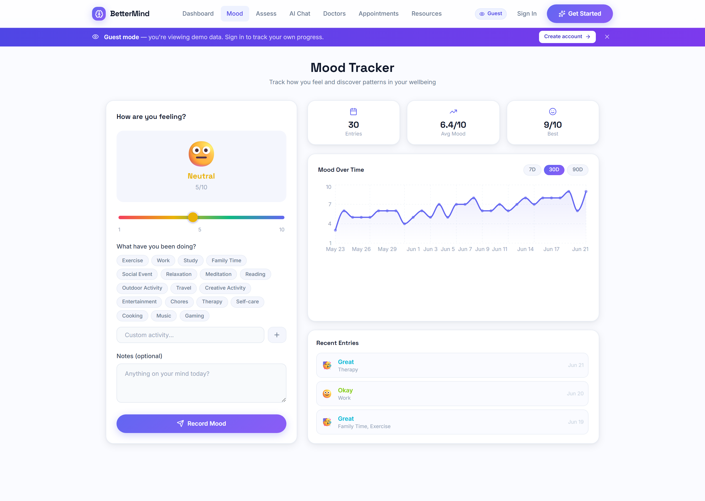
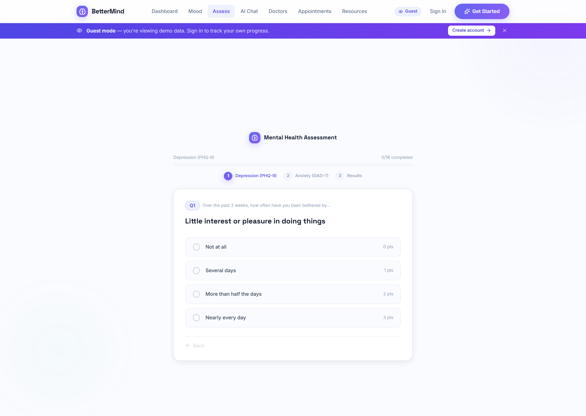
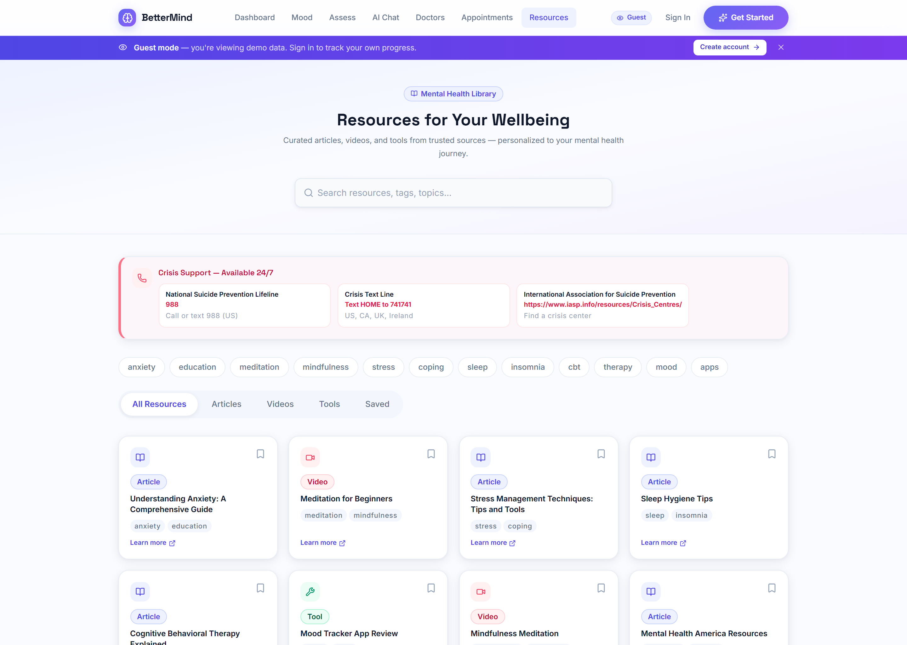

<div align="center">

# 🧠 BetterMind

### An AI-powered mental health platform — mood tracking, clinical assessments, an AI companion, and verified doctor booking, in one calm, beautiful product.

[](https://nextjs.org/)
[](https://react.dev/)
[](https://www.mongodb.com/)
[](https://tailwindcss.com/)
[](https://openai.com/)
[](https://www.framer.com/motion/)

**[Live Demo](#-guest-mode-no-sign-up-required) · [Features](#-features) · [Architecture](#-architecture) · [Tech Stack](#-tech-stack) · [Wiki](../../wiki)**

</div>

---

## Product Screenshots

### Landing Page



| Wellness Dashboard | Mood Tracker |
|---|---|
|  |  |

| Clinical Assessment | Resource Library |
|---|---|
|  |  |

---

## 📖 Overview

**BetterMind** is a full-stack mental health platform built with the Next.js App Router. It brings together the day-to-day tools people actually need for mental wellness — **daily mood logging**, **clinically-validated assessments (PHQ-9 & GAD-7)**, an **AI chat companion**, and **appointment booking with verified mental-health professionals** — behind a single, calming, accessibility-minded interface.

It supports three distinct roles (**patient**, **doctor**, **admin**), each with its own dashboard and permissions, all secured by a custom JWT auth layer with optional **TOTP two-factor authentication**, **AES-encrypted sensitive data**, and **rate-limited APIs**.

---

## 🎭 Guest Mode (no sign-up required)

Any visitor who isn't signed in is automatically in **Guest Mode** — no button to click, no opt-in required. The full platform is immediately browsable with realistic demo data: mood trends, assessment history, AI conversations, doctor listings, and appointments.

The moment a guest tries to *write* data (save a mood, book an appointment, message the AI), a modal invites them to create an account — so the experience is fully explorable but nothing leaks into the database.

---

## ✨ Features

### 🧑‍⚕️ For Patients
| Feature | Description |
|---|---|
| **Mood Tracking** | Log daily mood (1–10) with activities & notes; visualized as interactive trend charts |
| **Clinical Assessments** | Standardized **PHQ-9** (depression) and **GAD-7** (anxiety) with automatic severity scoring and a question-by-question history |
| **AI Companion** | Chat powered by **OpenAI gpt-4o-mini**, with the user's recent mood & assessment scores injected as context for personalized, safety-aware responses |
| **Insightful Dashboard** | Mood trends, assessment trends, activity-impact analysis, and mood↔severity correlation, all in light, animated Recharts visualizations |
| **Doctor Discovery & Booking** | Browse verified professionals by specialty, view ratings & reviews, and book real time-slots generated from each doctor's working hours |
| **Google Calendar Sync** | Appointments optionally sync to the doctor's Google Calendar via OAuth |
| **Resource Library** | 100+ curated articles, videos & tools, filterable by tag/category, with personalized recommendations based on your assessment and mood data |

### 🩺 For Doctors
- Verification workflow (pending → approved/rejected with reason)
- Profile editor with **education, experience, and a Mon–Sun working-hours grid**
- Dashboard with patient stats, ratings, and upcoming appointments
- Patient reviews & ratings (one per completed appointment)

### 🛡️ For Admins
- Doctor verification console (approve / reject with reason)
- Tabbed views: pending, verified, rejected

---

## 🏗️ Architecture

```
┌──────────────────────────────────────────────────────────────┐
│                      Next.js 14 App Router                      │
│                                                                  │
│  Client Components (RSC-aware)        API Route Handlers          │
│  ┌────────────────────────┐          ┌────────────────────────┐ │
│  │ Pages: dashboard, mood, │  fetch   │ /api/auth/*  (JWT, 2FA) │ │
│  │ assessment, chat,       │ ───────► │ /api/mood, /assessment  │ │
│  │ doctors, appointments…  │          │ /api/chat   (OpenAI)    │ │
│  │                         │ ◄─────── │ /api/doctors, /appts    │ │
│  │ AuthContext (+ Guest)   │   JSON   │ /api/doctor/*, /admin/* │ │
│  └────────────────────────┘          └───────────┬─────────────┘ │
└───────────────────────────────────────────────────┼──────────────┘
                                                      │
                  ┌───────────────────────────────────┼───────────────────┐
                  │                  │                 │                    │
            ┌─────▼─────┐     ┌──────▼──────┐   ┌──────▼──────┐    ┌────────▼────────┐
            │  MongoDB   │     │   OpenAI    │   │ Google APIs │    │  otplib (TOTP)  │
            │ (driver)   │     │ gpt-4o-mini │   │  Calendar   │    │   + AES crypto  │
            └────────────┘     └─────────────┘   └─────────────┘    └─────────────────┘
```

**Key design decisions**
- **Custom JWT auth** (httpOnly cookie) over a heavier auth framework — full control over the 2FA challenge flow and role gating.
- **Server-side auth verification with a short-lived in-memory cache** to avoid hammering the DB on every request.
- **Graceful degradation** everywhere: AI chat falls back to keyword matching without an API key; Calendar sync no-ops without OAuth tokens; the app boots even if optional env vars are missing.
- **Guest mode as a first-class client concern** — demo data lives entirely client-side and write actions are intercepted by a single `requireRealUser()` gate.

---

## 🛠️ Tech Stack

| Layer | Technologies |
|---|---|
| **Framework** | Next.js 14 (App Router, Route Handlers, Server/Client Components) |
| **UI** | React 18, Tailwind CSS 3, custom design-token system |
| **Animation** | Framer Motion 12 (layout animations, `AnimatePresence`, shared-layout nav) |
| **Data Viz** | Recharts 3 (area, line, bar, scatter charts) |
| **Database** | MongoDB 6 (official driver) |
| **Auth** | JWT (`jsonwebtoken`), httpOnly cookies, `bcryptjs`, **otplib** TOTP 2FA, `qrcode` |
| **AI** | OpenAI SDK (`gpt-4o-mini`) with context injection + keyword fallback |
| **Integrations** | Google APIs (`googleapis`) — Calendar sync via OAuth |
| **Security** | AES encryption for sensitive fields, in-memory rate limiting, role-based access control |
| **Icons** | lucide-react |

---

## 🔒 Security

- **JWT authentication** stored in httpOnly cookies, verified server-side on every protected route.
- **Two-Factor Authentication (TOTP)** — full enable/verify/disable flow with QR provisioning and one-time recovery codes; JWT issuance is gated on the 2FA challenge at login.
- **AES encryption** for sensitive data at rest.
- **Rate limiting** — login, registration (5/15min), chat (30/min), and assessments (20/hr) are throttled via a reusable limiter factory.
- **Role-based access control** — patient / doctor / admin separation enforced both client- and server-side.
- **Doctor verification** — professionals cannot accept appointments until an admin approves their credentials.

---

## 🚀 Getting Started

### Prerequisites
- Node.js 18+
- A MongoDB instance (local or Atlas)
- *(Optional)* OpenAI API key, Google OAuth credentials

### Installation

```bash
# 1. Clone
git clone https://github.com/harshcode1/BetterMind.git
cd BetterMind

# 2. Install
npm install

# 3. Configure environment — create .env.local in the project root
# (see Environment Variables section below)

# 4. Seed demo doctors (optional but recommended for a full demo)
node scripts/seed-doctors.mjs

# 5. Run
npm run dev
```

Open [http://localhost:3000](http://localhost:3000) — the platform loads in demo mode automatically if you're not signed in.

### Environment Variables

Create a `.env.local` file in the project root:

```bash
# Required
MONGODB_URI=mongodb+srv://<user>:<password>@<cluster>.mongodb.net/bettermind
JWT_SECRET=<any-long-random-string>

# Required for sensitive data encryption
ENCRYPTION_SECRET=<any-long-random-string>
ENCRYPTION_SALT=<any-short-string>

# Optional — features degrade gracefully if omitted
OPENAI_API_KEY=sk-...                 # AI chat (falls back to keyword matching)
GOOGLE_CLIENT_ID=...                  # Google Calendar sync
GOOGLE_CLIENT_SECRET=...
GOOGLE_REDIRECT_URI=http://localhost:3000/api/auth/google/callback
```

---

## 📁 Project Structure

```
BetterMind/
├── public/                      # Static assets
├── src/
│   └── app/
│       ├── api/                 # Route Handlers (auth, mood, assessment, chat, doctors, admin…)
│       │   └── auth/2fa/        # TOTP setup / verify / disable
│       ├── components/          # Navbar, Footer, GuestBanner, GuestGateModal
│       ├── contexts/            # AuthContext (auth + guest mode + auth-gate)
│       ├── dashboard/           # Dashboard + chart components
│       ├── doctor/              # Doctor portal (dashboard, profile, verification)
│       ├── admin/               # Admin verification console
│       ├── lib/                 # db, authServer, twoFactorAuth, openaiClient,
│       │                        #   googleCalendar, slotGenerator, rateLimit, encryption, demoData
│       ├── mood/  assessment/  chat/  doctors/  appointments/  resources/  settings/
│       ├── globals.css          # Light design system (tokens, components)
│       └── layout.js
├── tailwind.config.js           # Extended theme (brand/mint/calm/ink scales, shadows)
└── README.md
```

📚 **Deep technical documentation lives in the [Wiki](../../wiki)** — architecture, full API reference, auth & security internals, the design system, and guest-mode internals.

---

## 💼 Resume / Portfolio Highlights

> Copy-paste-ready bullets describing what this project demonstrates.

- Built a **full-stack mental health platform** with **Next.js 14 (App Router)**, **React 18**, **MongoDB**, and **Tailwind CSS**, supporting three role-based experiences (patient, doctor, admin).
- Engineered a **custom JWT authentication system** with **httpOnly cookies**, **bcrypt** hashing, **TOTP two-factor authentication** (QR provisioning + recovery codes via `otplib`), and **server-side verification with caching**.
- Integrated **OpenAI `gpt-4o-mini`** into an AI mental-health companion, **injecting the user's recent mood and clinical-assessment data as context** for personalized, safety-aware responses, with a graceful keyword-based fallback.
- Implemented **clinically-validated PHQ-9 & GAD-7 assessments** with automated severity scoring, historical trend visualization, and a question-by-question breakdown.
- Designed an **interactive analytics dashboard** with **Recharts** — mood trends, assessment trends, activity-impact analysis, and a **Pearson correlation** between mood and symptom severity.
- Built **doctor discovery & appointment booking** with availability slots, **Google Calendar OAuth sync**, ratings/reviews, and an **admin verification workflow**.
- Added **API rate limiting**, **AES encryption** for sensitive data, and **role-based access control** across the stack.
- Led a complete **UI/UX redesign** from a dark theme to a research-backed **calming light design system** (color psychology for mental health), built on Tailwind design tokens and Framer Motion micro-interactions.
- Shipped a **“Guest Mode”** that lets anyone explore the full product with realistic demo data while keeping all writes safely behind auth — purpose-built for frictionless demos.

---

## 🗺️ Roadmap

- [ ] Real-time doctor↔patient messaging (WebSockets)
- [ ] Push/email reminders for appointments and check-ins
- [ ] Exportable PDF wellness reports
- [ ] Mobile app (React Native) sharing the same API
- [ ] Expanded assessment library (PSS, WHO-5)

---

## 🤝 Contributing

1. Fork the repo
2. Create a feature branch (`git checkout -b feature/amazing-feature`)
3. Commit (`git commit -m 'Add amazing feature'`)
4. Push (`git push origin feature/amazing-feature`)
5. Open a Pull Request

## 📄 License

Licensed under the MIT License — see `LICENSE` for details.

---

<div align="center">
<sub>Built with care for mental wellness. 🧠💙</sub>
</div>
